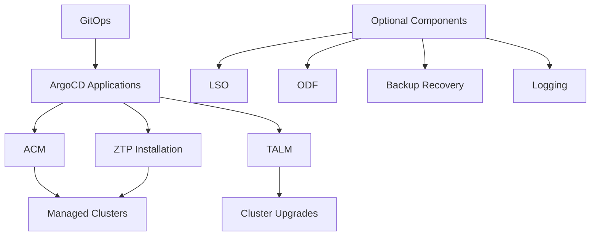

# Getting Started with Telco Hub Pattern

> **Complete guide to deploy and configure the Telco Hub Pattern for GitOps-based telco-hub management using Red Hat OpenShift, Advanced Cluster Management (ACM), and Zero Touch Provisioning (ZTP).**

[](https://www.redhat.com/en/technologies/cloud-computing/openshift)
[](https://validatedpatterns.io/)
[](https://helm.sh/)
[](https://argoproj.github.io/cd/)

---

## 📖 Table of Contents

- [Overview](#-overview)
- [Architecture](#️-architecture)
- [Prerequisites](#-prerequisites)
- [Quick Start](#-quick-start)
- [Configuration](#️-configuration)
- [Components](#-components)
- [Operations](#️-operations)
- [Troubleshooting](#-troubleshooting)
- [Next Steps](#-next-steps)

---

## 🎯 Overview

The **Telco Hub Pattern** delivers a production-ready, GitOps-based solution for deploying and managing telecommunications hub infrastructure. Built on the [Red Hat Validated Patterns](https://validatedpatterns.io/) framework, this pattern provides a modular approach to telco hub deployment with component-based enablement.

### Key Features

- **Component-Based Architecture**: Individual Helm charts for each component with enable/disable controls
- **GitOps-Native**: Fully automated deployment via ArgoCD with integrated patterns framework
- **Lifecycle Management**: Integrated cluster management and upgrade capabilities via TALM
- **Kustomize Patches**: Runtime customization without modifying [reference-crs](https://github.com/openshift-kni/telco-reference/tree/main/telco-hub/configuration/reference-crs) configurations
- **Zero Touch Provisioning**: Automated cluster installation and configuration workflows
- **Observability Ready**: Built-in monitoring and logging options

### Use Cases

- **Telco Edge Hub Management**: Deploy and manage multiple edge clusters from a central hub
- **Zero Touch Provisioning**: Automated cluster installation and configuration via ZTP workflow
- **Multi-Cluster Operations**: Centralized management of distributed telco infrastructure
- **GitOps Workflows**: Infrastructure-as-code with automated deployment and synchronization

### Rationale

The goal for this pattern is to:

- Use a GitOps approach to manage telco-hub configurations on OpenShift hub clusters
- Provide component-based deployment with granular control over GitOps ZTP components
- Demonstrate integration with telco-reference configurations via kustomize patches
- Support Zero Touch Provisioning workflows for automated cluster deployment
- Deliver a foundation for building GitOps-based telco applications and network functions

This pattern is designed specifically for telecommunications use cases and provides a hub cluster configuration optimized for telco workloads, network functions, and operational requirements with enterprise-grade lifecycle management.

---

## 🏗️ Architecture

### Pattern Structure

```bash
telco-hub-pattern/
├── charts/telco-hub/                    # 📦 Component Helm Charts
│   ├── required/                        # 🔧 Essential Components
│   │   ├── acm/                         # Advanced Cluster Management
│   │   ├── gitops/                      # GitOps Operators & Configuration
│   │   └── talm/                        # Topology Aware Lifecycle Manager
│   └── optional/                        # 🔌 Optional Components
│       ├── lso/                         # Local Storage Operator
│       ├── odf/                         # OpenShift Data Foundation
│       ├── backup-recovery/             # Backup & Recovery (OADP)
│       └── logging/                     # Cluster Logging Stack
├── overrides/values-telco-hub.yaml      # Component Configuration
├── values-hub.yaml                      # Hub Cluster Definition
├── values-global.yaml                   # Global Pattern Settings
└── docs/                                # Documentation
```

### Design Principles

| Principle                 | Description                                                            | Benefit                                               |
|---------------------------|------------------------------------------------------------------------|-------------------------------------------------------|
| **Component-Based**       | Individual Helm charts for each component with dedicated configuration | Granular control and independent lifecycle management |
| **GitOps-Native**         | ArgoCD manages all deployments via validated patterns framework        | Automated, auditable infrastructure changes           |
| **Kustomize Integration** | Runtime patches for environment-specific customization                 | Customize without modifying base configurations       |
| **Validation-First**      | Built on Red Hat Validated Patterns framework                          | Production-tested, enterprise-ready telco patterns    |

---

## ✅ Prerequisites

### System Requirements

#### OpenShift Cluster

- **Version**: OpenShift 4.14 or later
- **Size**: Compact cluster 3:0 nodes (minimum)
- **Storage**: 500GB+ available storage
- **Network**: internet connectivity for operator installations

#### Local Tools

```bash
# Required CLI tools
oc version              # OpenShift CLI 4.14+
git --version           # Git 2.x+

# Optional but recommended
jq --version            # JSON processing
yq --version            # YAML processing
```

#### Access Requirements

- **Cluster Admin**: Full administrative privileges on OpenShift cluster
- **Git repository** access for telco-reference configurations
- **oc CLI** tool configured and authenticated

---

## 🚀 Quick Start

### 1. Clone and Configure

```bash
# Clone the repository
git clone https://github.com/validatedpatterns-sandbox/telco-hub-pattern.git
cd telco-hub-pattern
```

### 2. Update Configuration

Edit `overrides/values-telco-hub.yaml` with your environment-specific settings:

```yaml
telcoHub:
  # -----------------------------------------------------------------------------
  # IMPORTANT: Only update these if your environment is disconnected!
  # -----------------------------------------------------------------------------
  git:
    repoURL: https://github.com/openshift-kni/telco-reference.git
    targetRevision: main

  # -----------------------------------------------------------------------------
  # Component Selection
  # -----------------------------------------------------------------------------
  components:
    # Required Components (recommended for telco-hub functionality)
    acm:             
      enabled: true                   # Advanced Cluster Management
    gitops:          
      enabled: true                   # GitOps operators and configuration
    talm:            
      enabled: true                   # Topology Aware Lifecycle Manager
    
    # ZTP Workflow (enable for cluster installation management)
    ztpInstallation: 
      enabled: false                  # Zero Touch Provisioning workflow
    
    # Optional Components (enable as needed)
    lso:             
      enabled: false                  # Local Storage Operator
    odf:             
      enabled: false                  # OpenShift Data Foundation
    backupRecovery:  
      enabled: false                  # Backup and Recovery
    logging:         
      enabled: false                  # Cluster Logging
```

### 3. Deploy the Pattern

```bash
# Deploy using the pattern framework
./pattern.sh make install
```

### 4. Verify Deployment

```bash
# Check pattern deployment status
./pattern.sh make argo-healthcheck

# Monitor ArgoCD applications
oc get applications.argoproj.io -n openshift-gitops
```

**🎉 Your Telco Hub is now deploying via GitOps!**

---

## ⚙️ Configuration

### Configuration Hierarchy

The pattern uses a three-tier configuration system:

| File                              | Purpose                         | When to Use                                  |
|-----------------------------------|---------------------------------|----------------------------------------------|
| `values-global.yaml`              | 🌍 Global pattern settings      | Cross-environment pattern configuration      |
| `values-hub.yaml`                 | 🏭 Telco Hub cluster definition | Telco Hub cluster structure and applications |
| `overrides/values-telco-hub.yaml` | 🎛️ Component configuration     | Component enablement and customization       |

### Component Configuration

Components are organized into logical categories:

#### Required Components

Essential for telco hub functionality:

```yaml
components:
  acm:
    enabled: true                     # Advanced Cluster Management
  gitops:
    enabled: true                     # GitOps Infrastructure (ArgoCD, operators)
  talm:
    enabled: true                     # Topology Aware Lifecycle Manager
```

#### ZTP Workflow

For automated cluster deployment:

```yaml
components:
  ztpInstallation:
    enabled: true                     # ZTP cluster installation workflow
```

#### Optional Components

Enable based on requirements:

```yaml
components:
  lso:
    enabled: false                    # Local Storage Operator
  odf:
    enabled: false                    # OpenShift Data Foundation
  backupRecovery:
    enabled: false                    # BBackup and Recovery (Velero/OADP)
  logging:
    enabled: false                    # Cluster Logging Operator
```

### Kustomize Patches

Apply environment-specific customizations:

```yaml
telcoHub:
  talm:
    kustomizePatches:
      - target:
          group: operators.coreos.com
          version: v1alpha1
          kind: Subscription
          name: openshift-topology-aware-lifecycle-manager-subscription
        patch: |-
          - op: replace
            path: "/spec/source"
            value: "redhat-operators-disconnected"
```

> **NOTE:** Above configuration can be used to deploy the TALM Operator in disconnected environments.

---

## 📦 Components

### Component Reference

| Component            | Type     | Description                                              | Chart Path                                                                                    |
|----------------------|----------|----------------------------------------------------------|-----------------------------------------------------------------------------------------------|
| **ACM**              | Required | Advanced Cluster Management for multi-cluster operations | [`charts/telco-hub/required/acm/`](../charts/telco-hub/required/acm/)                         |
| **GitOps**           | Required | ArgoCD operators and GitOps configuration                | [`charts/telco-hub/required/gitops/`](../charts/telco-hub/required/gitops/)                   |
| **TALM**             | Required | Topology Aware Lifecycle Manager for cluster updates     | [`charts/telco-hub/required/talm/`](../charts/telco-hub/required/talm/)                       |
| **ZTP Installation** | Workflow | Zero Touch Provisioning cluster installation workflow    | Enabled via [GitOps chart](../charts/telco-hub/required/gitops/)                              |
| **LSO**              | Optional | LocalStorage Operator for node-local storage             | [`charts/telco-hub/optional/lso/`](../charts/telco-hub/optional/lso/)                         |
| **ODF**              | Optional | OpenShift Data Foundation for persistent storage         | [`charts/telco-hub/optional/odf/`](../charts/telco-hub/optional/odf/)                         |
| **Backup Recovery**  | Optional | OADP for backup and disaster recovery                    | [`charts/telco-hub/optional/backup-recovery/`](../charts/telco-hub/optional/backup-recovery/) |
| **Logging**          | Optional | Cluster Logging Operator for log aggregation             | [`charts/telco-hub/optional/logging/`](../charts/telco-hub/optional/logging/)                 |

### Component Dependencies



---

## 🛠️ Operations

### Available Commands

The pattern includes comprehensive management via the pattern framework:

```bash
-> ./pattern.sh help

Pattern: telco-hub-pattern

Usage:
  make <target>

Pattern tasks
  install                              installs the pattern and loads the secrets
  post-install                         Post-install tasks

Pattern Common Tasks
  help                                 This help message
  show                                 show the starting template without installing it
  preview-all                          (EXPERIMENTAL) Previews all applications on hub and managed clusters
  operator-deploy operator-upgrade     runs helm install
  uninstall                            runs helm uninstall
  load-secrets                         loads the secrets into the backend determined by values-global setting
  legacy-load-secrets                  loads the secrets into vault (only)
  secrets-backend-vault                Edits values files to use default Vault+ESO secrets config
  secrets-backend-kubernetes           Edits values file to use Kubernetes+ESO secrets config
  secrets-backend-none                 Edits values files to remove secrets manager + ESO
  load-iib                             CI target to install Index Image Bundles
  token-kubeconfig                     Create a local ~/.kube/config with password (not usually needed)

Validation Tasks
  validate-origin                      verify the git origin is available
  validate-cluster                     Do some cluster validations before installing
  validate-schema                      validates values files against schema in common/clustergroup
  validate-prereq                      verify pre-requisites
  argo-healthcheck                     Checks if all argo applications are synced

Test and Linters Tasks
  qe-tests                             Runs the tests that QE runs
  super-linter                         Runs super linter locally
```

### Day-2 Operations

#### Enabling Components

```bash
# Edit configuration to enable components
vi overrides/values-telco-hub.yaml

# Apply changes
./pattern.sh make operator-upgrade
```

#### Updating Git Configuration

```bash
# Update Git repository settings
vi overrides/values-telco-hub.yaml

# Apply configuration changes
./pattern.sh make operator-upgrade
```

#### Monitoring Deployment

```bash
# Watch ArgoCD applications
watch oc get applications.argoproj.io -n openshift-gitops

# Check individual application status
oc describe applications.argoproj.io talm -n openshift-gitops
```

### Access ArgoCD UI

```bash
# Get ArgoCD route
echo "ArgoCD UI: https://$(oc get route openshift-gitops-server -n openshift-gitops -o jsonpath='{.spec.host}')"

# Get admin password
oc extract secret/openshift-gitops-cluster -n openshift-gitops --to=-
```

---

## 🔧 Troubleshooting

### Common Issues

#### 1. Component Sync Failures

**Problem**: ArgoCD applications showing sync errors

```bash
# Check application status
oc get applications.argoproj.io -n openshift-gitops -o wide

# View detailed status
oc describe applications.argoproj.io <app-name> -n openshift-gitops
```

**Solution**: Verify component configuration and kustomize patches

#### 2. Git Repository Access

**Problem**: ArgoCD cannot access Git repositories

```bash
# Check repository configuration
grep -r repoURL overrides/values-telco-hub.yaml
```

**Solution**: Verify repository URLs and configure Git credentials if needed

#### 3. Component Dependencies

**Problem**: Components failing due to missing dependencies

```bash
# Check operator status
oc get csv -A | grep -E "(acm|gitops|talm)"
```

**Solution**: Ensure required operators are installed and components are properly enabled

### Support Resources

- 📖 [Main Documentation](../README.md)
- 🔍 [Red Hat Validated Patterns](https://validatedpatterns.io/)
- 💬 [OpenShift GitOps Documentation](https://docs.redhat.com/en/documentation/red_hat_openshift_gitops/latest/html/understanding_openshift_gitops/about-redhat-openshift-gitops)

---

## 📚 Next Steps

### Immediate Actions

1. **Explore ArgoCD UI**: Familiarize yourself with the GitOps interface
2. **Review Component Status**: Ensure all enabled components are healthy
3. **Test Configuration Changes**: Make a small change and observe the sync process
4. **Setup Monitoring**: Configure alerts for pattern health

### Component Documentation

Each component includes comprehensive documentation:

- [ACM Configuration](../charts/telco-hub/required/acm/README.md)
- [GitOps Setup](../charts/telco-hub/required/gitops/README.md)  
- [TALM Management](../charts/telco-hub/required/talm/README.md)
- [Optional Components](../charts/telco-hub/optional/)

### External Resources

- [Red Hat Validated Patterns](https://validatedpatterns.io/learn)
- [OpenShift GitOps](https://docs.redhat.com/en/documentation/red_hat_openshift_gitops/latest/html/understanding_openshift_gitops/about-redhat-openshift-gitops)
- [Advanced Cluster Management](https://access.redhat.com/documentation/en-us/red_hat_advanced_cluster_management_for_kubernetes/)
- [Zero Touch Provisioning](https://docs.openshift.com/container-platform/latest/scalability_and_performance/ztp_far_edge/ztp-deploying-far-edge-clusters-at-scale.html)

---

<div align="center">

**Ready to deploy your Telco Hub?**

[Report Issues](https://github.com/validatedpatterns-sandbox/telco-hub-pattern/issues) • [Main Documentation](../README.md)

---

## Complete Guide for Telco Hub Pattern

</div>
